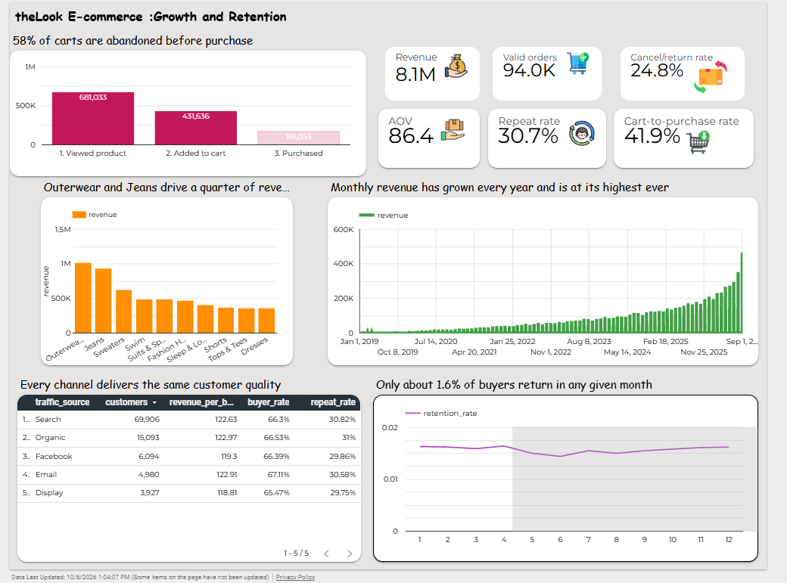
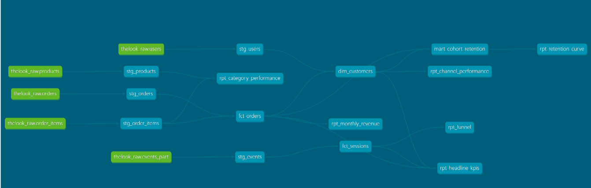

# theLook E-commerce: Growth and Retention Analytics

An end-to-end analytics project on a cloud data warehouse. Raw e-commerce data is loaded into BigQuery, modelled and tested with dbt, and turned into a dashboard, an executive memo and a five-slide deck that answer one question: where is this store losing revenue, and what should it fix first?

- **Dashboard:** [Data Studio report](https://datastudio.google.com/reporting/fec0032a-8cc0-4c5f-ae0d-2ea8c0c78061)
- **Executive memo:** [docs/executive_memo.pdf](docs/executive_memo.pdf)
- **Slide deck:** [docs/deck.pdf](docs/deck.pdf)



## Key findings

| Finding | Number |
| --- | --- |
| Revenue grows more than 40% every year | 1.87M in 2025, up 46%; Jan to Sep 2026 already 2.53M |
| Checkout is the biggest leak | 58.1% of carts abandoned (250,603 sessions) |
| One in four orders is not kept | 24.8% cancelled or returned |
| Most buyers buy once | 30.7% repeat rate; about 1.6% of buyers return in any later month |
| Channels deliver the same customer quality | Repeat rate 30% to 31% across all five channels |
| Two categories carry a quarter of revenue | Outerwear & Coats and Jeans: 24% of revenue |

Headline metrics: 8.12M kept revenue, 93,999 valid orders, average order value 86.36, gross margin 51.9%.

## Tech stack

| Layer | Tool |
| --- | --- |
| Warehouse | Google BigQuery (sandbox) |
| Transformation and testing | dbt Core 1.12 with the BigQuery adapter, run from Google Cloud Shell |
| Dashboard | Data Studio (formerly Looker Studio) |
| Version control | Git and GitHub |

## Data

Source: `bigquery-public-data.thelook_ecommerce`, a public synthetic dataset of an online clothing store. A snapshot was copied into the project on 4 October 2026 so that results stay fixed.

| Table | Rows | One row is |
| --- | --- | --- |
| orders | 124,966 | one order |
| order_items | 181,033 | one item in an order |
| users | 100,000 | one registered customer |
| products | about 29,000 | one catalogue product |
| events | about 2.4 million | one action on the website |

## Data model



The project has 15 dbt models in three layers.

| Layer | Models | Purpose |
| --- | --- | --- |
| Staging (views) | `stg_orders`, `stg_order_items`, `stg_users`, `stg_products`, `stg_events` | One model per raw table. Selects the needed columns and gives keys clear names. Personal details such as names and emails are left out. |
| Marts (tables) | `fct_orders`, `dim_customers`, `fct_sessions`, `mart_cohort_retention` | Business-ready tables at a defined grain: one row per order, customer, session, and cohort-month. |
| Reporting (tables) | `rpt_headline_kpis`, `rpt_monthly_revenue`, `rpt_funnel`, `rpt_channel_performance`, `rpt_retention_curve`, `rpt_category_performance` | Small tables shaped for charts, so the dashboard holds no hidden logic. |

## Data quality

20 dbt tests run with every build:

- `unique` and `not_null` on every primary key
- `accepted_values` on order status
- `relationships` from order items to orders, and from orders to customers

`dbt build` runs all 15 models and 20 tests in dependency order. All 35 pass.

## Warehouse optimisation

The events table (about 2.4 million rows) was partitioned by year and clustered by event type.

```sql
create table thelook_raw.events_part
partition by range_bucket(event_year, generate_array(2019, 2028, 1))
cluster by event_type
as
select *, extract(year from created_at) as event_year
from thelook_raw.events;
```

| Query: purchase events in 2025 | Data scanned |
| --- | --- |
| Unpartitioned table, filter on `created_at` | 39 MB |
| Partitioned table, filter on `event_year` | 7.18 MB |

That is an 82% reduction for the same result (41,809 rows counted).

Integer-range partitioning was used instead of date partitioning because the BigQuery sandbox expires date partitions older than 60 days.

## Metric definitions

| Metric | Definition |
| --- | --- |
| Valid order | An order whose status is not Cancelled or Returned |
| Kept revenue | Sum of sale price over valid orders |
| Average order value | Kept revenue divided by valid orders |
| Cart-to-purchase rate | Sessions with a purchase divided by sessions with an add-to-cart |
| Repeat rate | Customers with two or more valid orders divided by customers with at least one |
| Cohort retention | Share of a first-purchase month's customers who order again N months later |
| Gross margin | Sale price less product cost, divided by sale price |

## How to run

```bash
python3 -m venv ~/dbt-env
source ~/dbt-env/bin/activate
pip install dbt-core dbt-bigquery

dbt debug     # check the BigQuery connection
dbt build     # run all models and tests
dbt docs generate && dbt docs serve   # browse the docs and lineage graph
```

The dbt profile uses OAuth against a BigQuery project that holds a `thelook_raw` dataset with copies of the five source tables.

## Limits

- The dataset is synthetic, so patterns are more uniform than real customer behaviour. Every session views a product, and channels perform almost identically.
- There is no marketing spend data, so acquisition cost and return on spend cannot be calculated.
- Each website session maps to one purchased item, so the funnel counts items, not baskets.
- Sandbox tables expire after 60 days. The screenshots and PDFs in `docs/` are the permanent record of the dashboard.

## Repository layout

```
models/
  staging/     source definitions, 5 staging models, tests
  marts/       4 mart models, 6 reporting models, tests
docs/          dashboard and lineage screenshots, memo, deck
dbt_project.yml
```

## Author

B Nikhileshwar

